# 📋 Plano de Implementação - Correções do Projeto ÉDEN

> **Baseado em:** Auditoria Profunda (05/01/2026)  
> **Estimativa Total:** 40-60 horas de desenvolvimento  
> **Priorização:** Segurança → Arquitetura → Qualidade → Performance

---

## 🎯 Visão Geral das Fases

```mermaid
gantt
    title Plano de Correções ÉDEN
    dateFormat  YYYY-MM-DD
    section Fase 1 - Segurança
    Rotação de Credenciais       :crit, a1, 2026-01-06, 1d
    Variáveis de Ambiente        :crit, a2, after a1, 1d
    Firestore Rules              :crit, a3, after a2, 2d
    Backend para Gemini API      :a4, after a3, 3d
    section Fase 2 - Arquitetura
    Remover CDN/ImportMaps       :b1, after a4, 1d
    Instalar Tailwind npm        :b2, after b1, 1d
    Estrutura de Pastas          :b3, after b2, 1d
    Refatorar App.tsx            :b4, after b3, 5d
    Implementar Router           :b5, after b4, 2d
    section Fase 3 - Qualidade
    Configurar TypeScript Strict :c1, after b5, 1d
    ESLint + Prettier            :c2, after c1, 1d
    Remover console.logs         :c3, after c2, 1d
    Testes Básicos               :c4, after c3, 3d
    section Fase 4 - Performance
    Lazy Loading                 :d1, after c4, 2d
    Cache Local (IndexedDB)      :d2, after d1, 2d
    Otimização de Imagens        :d3, after d2, 1d
```



---

## 📦 FASE 1: SEGURANÇA (Crítico - 1 semana)

### 1.1 Rotação de Credenciais Firebase
**Prioridade:** 🔴 URGENTE  
**Tempo:** 2-4 horas

**Passos:**
1. Acessar [Firebase Console](https://console.firebase.google.com)
2. Projeto: `gen-lang-client-0295226702`
3. Configurações → Geral → Regenerar chaves
4. Atualizar `.env.local` com novas chaves
5. Verificar se aplicação funciona com novas credenciais

---

### 1.2 Variáveis de Ambiente
**Prioridade:** 🔴 URGENTE  
**Tempo:** 1-2 horas

**Arquivos a modificar:**
- `services/firebase.ts`
- `.env.local` (criar)
- `.gitignore` (atualizar)

**Implementação:**

```typescript
// services/firebase.ts (NOVO)
const firebaseConfig = {
  apiKey: import.meta.env.VITE_FIREBASE_API_KEY,
  authDomain: import.meta.env.VITE_FIREBASE_AUTH_DOMAIN,
  projectId: import.meta.env.VITE_FIREBASE_PROJECT_ID,
  storageBucket: import.meta.env.VITE_FIREBASE_STORAGE_BUCKET,
  messagingSenderId: import.meta.env.VITE_FIREBASE_MESSAGING_SENDER_ID,
  appId: import.meta.env.VITE_FIREBASE_APP_ID,
};
```

```env
# .env.local
VITE_FIREBASE_API_KEY=sua_nova_chave
VITE_FIREBASE_AUTH_DOMAIN=...
VITE_FIREBASE_PROJECT_ID=...
VITE_FIREBASE_STORAGE_BUCKET=...
VITE_FIREBASE_MESSAGING_SENDER_ID=...
VITE_FIREBASE_APP_ID=...
VITE_GEMINI_API_KEY=...
```

---

### 1.3 Firestore Security Rules
**Prioridade:** 🔴 URGENTE  
**Tempo:** 4-6 horas

**Criar arquivo:** `firestore.rules`

```javascript
rules_version = '2';
service cloud.firestore {
  match /databases/{database}/documents {
    // Usuários podem ler/escrever apenas seus próprios dados
    match /users/{userId} {
      allow read, write: if request.auth != null && request.auth.uid == userId;
      
      // Subcoleções do usuário
      match /restore_points/{pointId} {
        allow read, write: if request.auth != null && request.auth.uid == userId;
      }
    }
    
    // Cache de bíblia - leitura pública, escrita apenas autenticados
    match /bible_cache/{docId} {
      allow read: if true;
      allow write: if request.auth != null;
    }
    
    // Biblioteca - leitura para todos, escrita para admins
    match /library/{docId} {
      allow read: if request.auth != null;
      allow write: if request.auth != null && 
        get(/databases/$(database)/documents/users/$(request.auth.uid)).data.role == 'admin';
    }
  }
}
```

---

### 1.4 Backend para Gemini API
**Prioridade:** 🟠 ALTA  
**Tempo:** 8-12 horas

**Opções:**
1. **Firebase Cloud Functions** (Recomendado)
2. **Edge Functions (Vercel/Netlify)**
3. **API Route (Next.js)**

**Estrutura proposta:**

```
functions/
├── src/
│   ├── index.ts          # Entry point
│   ├── gemini/
│   │   ├── bibleContent.ts
│   │   ├── storyboard.ts
│   │   ├── locations.ts
│   │   └── ...
│   └── middleware/
│       └── auth.ts       # Verificar token Firebase
```

---

## 📦 FASE 2: ARQUITETURA (Severo - 2 semanas)

### 2.1 Remover CDN e Import Maps
**Tempo:** 2-3 horas

**Modificar:** `index.html`
- Remover `<script src="https://cdn.tailwindcss.com">`
- Remover bloco `<script type="importmap">`
- Remover configuração inline do Tailwind

---

### 2.2 Instalar Tailwind via npm
**Tempo:** 2-3 horas

```bash
npm install -D tailwindcss postcss autoprefixer
npx tailwindcss init -p
```

**Criar:** `tailwind.config.js`
```javascript
export default {
  content: ["./index.html", "./src/**/*.{js,ts,jsx,tsx}"],
  theme: {
    extend: {
      colors: {
        bible: {
          paper: '#F5F5DC',
          secondary: '#EFEBE9',
          card: '#FFFFFF',
          hover: '#D7CCC8',
          text: '#3E2723',
          'text-light': '#5D4037',
          accent: '#388E3C',
          'accent-hover': '#2E7D32',
          border: '#D7CCC8',
          gold: '#827717',
          error: '#C62828'
        }
      },
      fontFamily: {
        sans: ['Lato', 'sans-serif'],
        serif: ['"Crimson Text"', 'serif'],
      }
    }
  },
  plugins: [],
}
```

---

### 2.3 Nova Estrutura de Pastas
**Tempo:** 4-6 horas

```
src/
├── components/
│   ├── ui/                  # Componentes base
│   │   ├── Button.tsx
│   │   ├── Input.tsx
│   │   └── Modal.tsx
│   ├── layout/              # Layout components
│   │   ├── Header.tsx
│   │   ├── Sidebar.tsx
│   │   └── MainLayout.tsx
│   ├── bible/               # Componentes de leitura
│   │   ├── BibleReader.tsx
│   │   ├── VerseDisplay.tsx
│   │   └── ChapterSelector.tsx
│   ├── features/            # Features específicas
│   │   ├── Interlinear/
│   │   ├── Theology/
│   │   ├── Devotional/
│   │   └── Library/
│   └── auth/                # Autenticação
│       ├── LoginForm.tsx
│       └── RegisterForm.tsx
├── hooks/
│   ├── useAuth.ts
│   ├── useBibleReader.ts
│   ├── useAudio.ts
│   └── useRestorePoints.ts
├── contexts/
│   ├── AuthContext.tsx
│   ├── BibleContext.tsx
│   └── LanguageContext.tsx
├── services/
│   ├── firebase.ts
│   └── api.ts               # Chamadas ao backend
├── pages/
│   ├── HomePage.tsx
│   ├── ReadingPage.tsx
│   ├── StudyPage.tsx
│   └── LibraryPage.tsx
├── types/
│   └── index.ts
├── constants/
│   └── index.ts
├── utils/
│   ├── formatters.ts
│   └── validators.ts
└── App.tsx                  # Apenas routing
```

---

### 2.4 Refatorar App.tsx
**Tempo:** 20-30 horas

**Estratégia de extração:**

| Responsabilidade | Destino |
|------------------|---------|
| Estados de autenticação | `contexts/AuthContext.tsx` + `hooks/useAuth.ts` |
| Estados de leitura bíblica | `contexts/BibleContext.tsx` + `hooks/useBibleReader.ts` |
| Lógica de áudio | `hooks/useAudio.ts` |
| Renderização de login | `components/auth/LoginForm.tsx` |
| Seletor de livros | `components/bible/BookSelector.tsx` |
| Tabs de features | `pages/` separadas |

---

### 2.5 Implementar React Router
**Tempo:** 4-6 horas

```bash
npm install react-router-dom
```

```typescript
// App.tsx (NOVO)
import { BrowserRouter, Routes, Route } from 'react-router-dom';

export default function App() {
  return (
    <BrowserRouter>
      <AuthProvider>
        <Routes>
          <Route path="/login" element={<LoginPage />} />
          <Route path="/" element={<ProtectedRoute><MainLayout /></ProtectedRoute>}>
            <Route index element={<ReadingPage />} />
            <Route path="study" element={<StudyPage />} />
            <Route path="interlinear" element={<InterlinearPage />} />
            <Route path="library" element={<LibraryPage />} />
            <Route path="devotional" element={<DevotionalPage />} />
          </Route>
        </Routes>
      </AuthProvider>
    </BrowserRouter>
  );
}
```

---

## 📦 FASE 3: QUALIDADE (Moderado - 1 semana)

### 3.1 TypeScript Strict Mode
**Tempo:** 4-6 horas

**Modificar:** `tsconfig.json`
```json
{
  "compilerOptions": {
    "strict": true,
    "noImplicitAny": true,
    "strictNullChecks": true,
    "noUnusedLocals": true,
    "noUnusedParameters": true
  }
}
```

**Corrigir:** Erros de tipo que aparecerão após ativar strict mode.

---

### 3.2 ESLint + Prettier
**Tempo:** 2-3 horas

```bash
npm install -D eslint @eslint/js typescript-eslint prettier eslint-config-prettier
```

---

### 3.3 Remover Console.logs
**Tempo:** 1-2 horas

Criar logger personalizado:
```typescript
// utils/logger.ts
const isDev = import.meta.env.DEV;

export const logger = {
  log: (...args: any[]) => isDev && console.log(...args),
  error: (...args: any[]) => console.error(...args), // Manter erros
  warn: (...args: any[]) => isDev && console.warn(...args),
};
```

---

### 3.4 Testes Básicos
**Tempo:** 8-12 horas

```bash
npm install -D vitest @testing-library/react @testing-library/jest-dom jsdom
```

**Testes prioritários:**
1. `hooks/useAuth.test.ts`
2. `components/SimpleMarkdown.test.tsx`
3. `services/geminiService.test.ts` (mocks)

---

## 📦 FASE 4: PERFORMANCE (Baixo - 1 semana)

### 4.1 Lazy Loading
**Tempo:** 4-6 horas

```typescript
const InterlinearPage = lazy(() => import('./pages/InterlinearPage'));
const LibraryPage = lazy(() => import('./pages/LibraryPage'));
const DevotionalPage = lazy(() => import('./pages/DevotionalPage'));
```

---

### 4.2 Cache Local com IndexedDB
**Tempo:** 6-8 horas

```bash
npm install idb
```

---

### 4.3 Otimização de Imagens
**Tempo:** 3-4 horas

- Converter base64 para blobs
- Usar compression antes de exibir
- Implementar lazy loading de imagens

---

## ✅ Checklist de Conclusão

### Fase 1 - Segurança
- [ ] Credenciais Firebase rotacionadas
- [ ] Variáveis de ambiente configuradas
- [ ] Firestore Rules implementadas
- [ ] Backend para Gemini criado

### Fase 2 - Arquitetura
- [ ] CDN/ImportMaps removidos
- [ ] Tailwind via npm instalado
- [ ] Estrutura de pastas criada
- [ ] App.tsx refatorado
- [ ] React Router implementado

### Fase 3 - Qualidade
- [ ] TypeScript strict mode ativado
- [ ] ESLint + Prettier configurados
- [ ] Console.logs removidos
- [ ] Testes básicos escritos

### Fase 4 - Performance
- [ ] Lazy loading implementado
- [ ] Cache IndexedDB funcionando
- [ ] Imagens otimizadas
